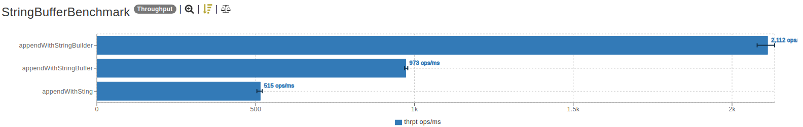
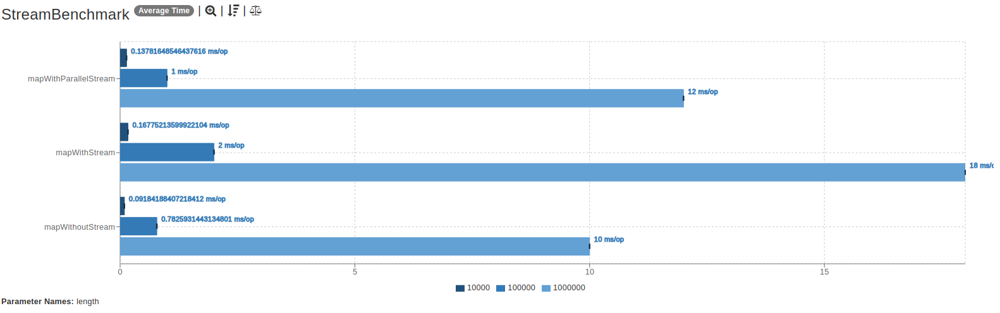
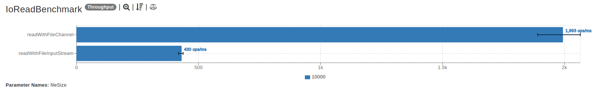

# Benchmarks for normal java code snippets

Hardware information
- CPU: AMD R5 3550H
- RAM: 16GB
- OS: Ubuntu 20.04 LTS

Software information
- JDK: OpenJDK 11.0.10
- Jmh: 1.29
---

## String VS StringBuffer VS StringBuilder
Concat 100 character, the throughput result:

## Stream VS ParallelStream VS Legacy Loop
Map 10000/100000/1000000 integers, the average time result:

## Stream VS Channel read/write file
Read 1 byte from file:

